<div align="center">

# 🎓 나의 직무 아카데미아

**설명 말고 경험으로 발견하는 나의 직무**

AI 아바타와 진로를 상담하고, 가상 회사에 출근해 하루치 업무를 겪어 봅니다.
그 기록을 모아 어떤 일이 나와 맞는지 리포트로 정리해 줍니다.


</div>

---

## 📖 About The Project

### 🎯 Problem

직무를 고를 때 참고할 수 있는 건 대부분 **간접 정보**입니다.

- **적성검사** — 성향은 알려주지만 실제 업무와 연결되지 않습니다
- **직무 소개** — 담당 업무는 적혀 있어도, 나한테 맞는지는 알 수 없습니다
- **인턴 · 현장실습** — 직접 해볼 수 있지만 기회가 적고 오래 걸립니다

결국 **해보지 않은 채로** 진로를 정하게 됩니다.

### 💡 Solution

**직접 해보게 합니다.**

1. **AI 진로 상담** — 아바타와 이야기하며 관심사와 성향을 정리하고 직무를 추천받습니다
2. **가상 회사 출근** — 추천받은 직무의 사무실로 들어가 사수·동료·고객을 만납니다
3. **업무 수행** — 자료를 대조하고, 순서를 정하고, 보고서를 씁니다
4. **AI 코치** — 대화와 업무를 지켜보다가 필요할 때 바로 짚어 줍니다
5. **적성 리포트** — 무엇을 잘했고 어디서 막혔는지 근거와 함께 정리해 줍니다

> 읽고 고르는 진로 탐색에서, **해보고 고르는** 진로 탐색으로.

---

## ✨ Features

| | 기능 | 설명 |
|---|---|---|
| 🧭 | **사전 설문 · 적성 진단** | 35개 문항으로 흥미 유형과 성향을 확인해 추천 근거로 씁니다 |
| 🤖 | **1:1 AI 진로 상담** | 립싱크 아바타와 음성·텍스트로 이야기합니다. 상담에서 한 말을 그대로 인용해 추천 이유를 설명합니다 |
| 🏢 | **가상 회사 체험** | 직무군 38개, 체험 시나리오 37종. 시나리오마다 전용 맵이 있고 사수·동료·고객이 저마다 제 역할대로 움직입니다 |
| 💬 | **NPC 대화** | 사수·상급자·동료·고객이 관계에 따라 다른 말투로 대화합니다. 컴플레인 응대 같은 껄끄러운 상황도 구현되어 있습니다 |
| 📋 | **자료를 보고 푸는 과제** | POS 내역·영수증 같은 자료를 대조해 답을 찾습니다. 자료 세트는 여러 벌 중 하나가 무작위로 배정됩니다 |
| 🎮 | **직무 미니게임** | 물건 피킹·운반, 손님 요구 파악, 콘텐츠 제작처럼 몸으로 익히는 일은 게임으로 |
| 🎯 | **실시간 AI 코치** | 대화를 계속 지켜보다가 말실수는 짚어 주고, 막히면 다음에 뭘 할지 알려 줍니다 |
| 📊 | **직무 적합도 리포트** | 역량 레이더와 미션 평가를, 점수가 나온 근거까지 붙여 PDF로 만들어 줍니다 |

---

## 🎬 Demo

### 1. 시작하기

<table>
<tr>
<td width="50%" align="center"><b>오프닝</b></td>
<td width="50%" align="center"><b>회원가입</b></td>
</tr>
<tr>
<td>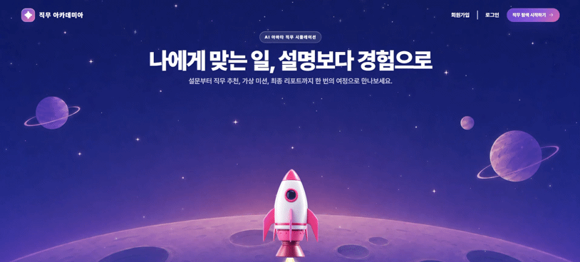</td>
<td>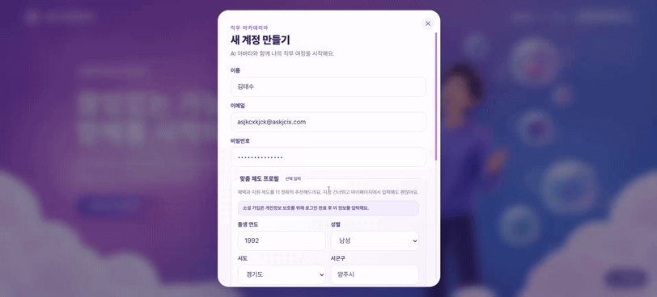</td>
</tr>
<tr>
<td width="50%" align="center"><b>로그인</b></td>
<td width="50%" align="center"><b>메인 메뉴</b></td>
</tr>
<tr>
<td>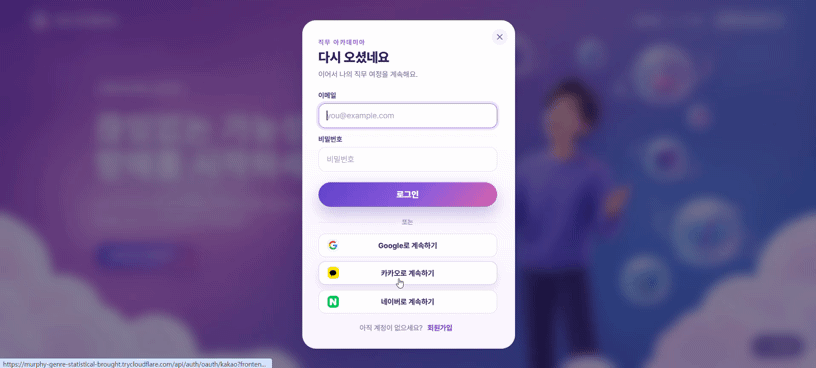</td>
<td>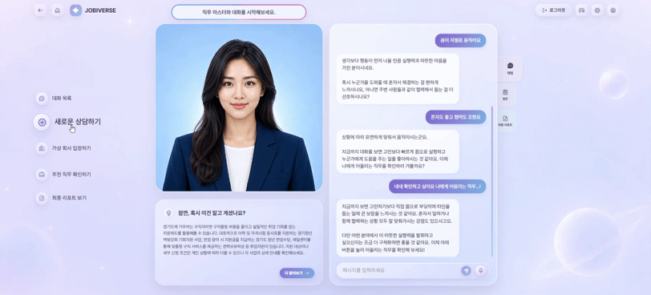</td>
</tr>
<tr>
<td width="50%" align="center"><b>AI 코치와 대화</b></td>
<td width="50%" align="center"><b>마이페이지</b></td>
</tr>
<tr>
<td>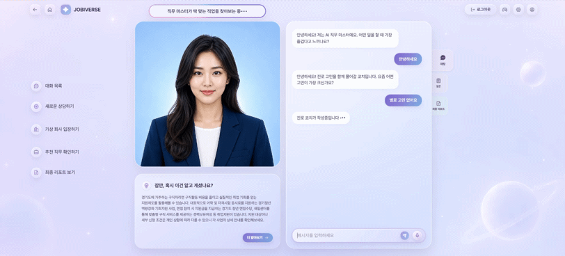</td>
<td>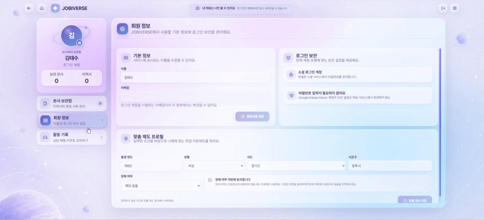</td>
</tr>
</table>

### 2. 진단 · 상담

<table>
<tr>
<td width="50%" align="center"><b>사전 설문 · 적성 진단</b></td>
<td width="50%" align="center"><b>맞춤 청년정책 안내</b></td>
</tr>
<tr>
<td>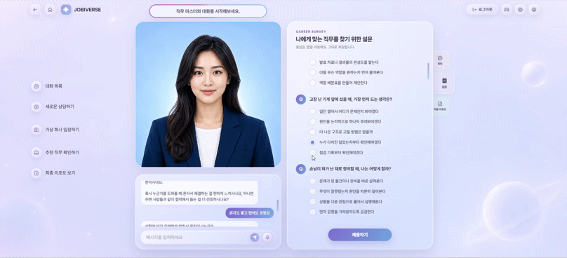</td>
<td>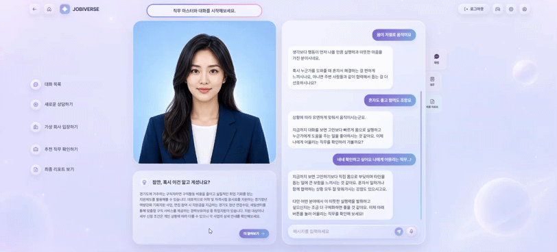</td>
</tr>
<tr>
<td width="50%" align="center"><b>추천 직무 확인</b></td>
<td width="50%" align="center"><b>진로 코치 변경</b></td>
</tr>
<tr>
<td>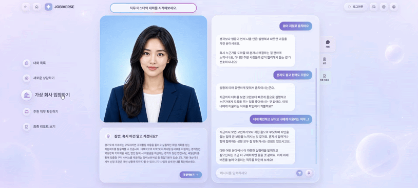</td>
<td>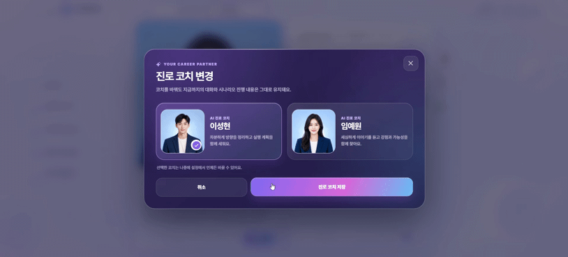</td>
</tr>
</table>

### 3. 가상 회사 체험

<table>
<tr>
<td width="50%" align="center"><b>출근 · 팀 소개 투어</b></td>
<td width="50%" align="center"><b>업무 진행</b></td>
</tr>
<tr>
<td>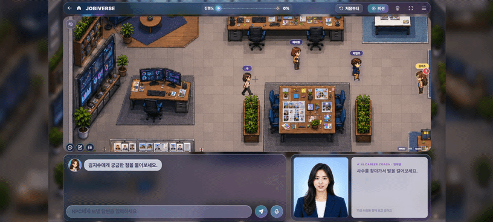</td>
<td>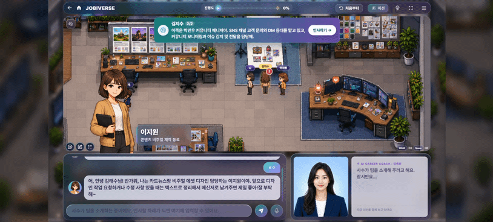</td>
</tr>
</table>

### 4. 퀴즈 풀기와 미니게임

<table>
<tr>
<td width="50%" align="center"><b>퀴즈 풀기 ①</b></td>
<td width="50%" align="center"><b>퀴즈 풀기 ②</b></td>
</tr>
<tr>
<td>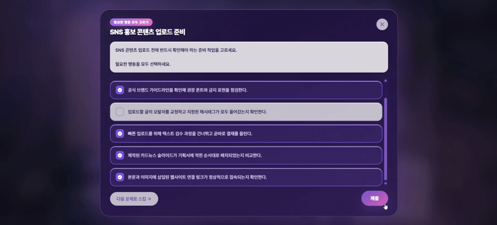</td>
<td>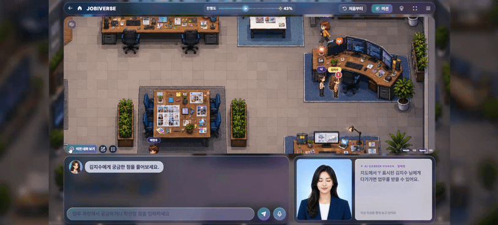</td>
</tr>
<tr>
<td width="50%" align="center"><b>미니게임 — 콘텐츠·SNS 자료 수집</b></td>
<td width="50%" align="center"><b>미니게임 — 게시물 시안 제작</b></td>
</tr>
<tr>
<td>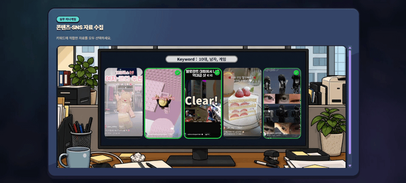</td>
<td>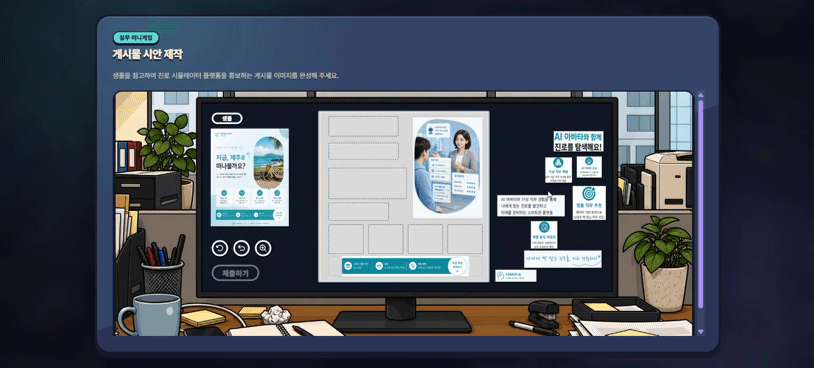</td>
</tr>
</table>

### 5. 체험 마무리 · 리포트

<table>
<tr>
<td width="50%" align="center"><b>체험 완료 · 소감문 작성</b></td>
<td width="50%" align="center"><b>직무 적합도 리포트</b></td>
</tr>
<tr>
<td>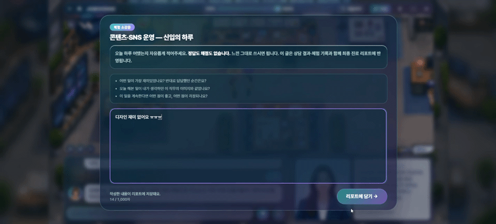</td>
<td>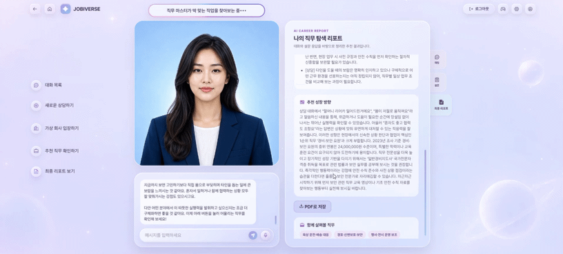</td>
</tr>
</table>

---

## 🛠 Tech Stack

| 구분 | 기술 |
|---|---|
| **Frontend** | React 19, TypeScript, Vite, CSS Modules, Motion, Phosphor Icons, hls.js |
| **Backend** | FastAPI, SQLAlchemy(asyncio), Alembic, Pydantic Settings, SSE |
| **Database** | PostgreSQL + pgvector (RAG 임베딩), Redis |
| **AI / LLM** | OpenAI, Google GenAI(Gemini) — NPC 대화 · 코치 · 채점 · 추천 근거 |
| **Avatar / Voice** | MuseTalk 립싱크(Gradio Client), ElevenLabs · gTTS |
| **Report** | ReportLab, pypdf, Pretendard |
| **Infra** | Docker Compose, Nginx |
| **Quality** | pytest(564 cases), ruff, TypeScript strict |

---

## 🚀 통합 실행 방법

### 1. 환경 변수

루트에 `.env` 파일을 만들고 아래 값을 채웁니다.

```bash
DATABASE_URL=postgresql+asyncpg://<user>:<password>@<host>:5432/postgres?ssl=require
REDIS_URL=redis://redis:6379/0
JWT_SECRET=<임의의 긴 문자열>
OPENAI_API_KEY=<키>
GOOGLE_API_KEY=<키>
```

> 로컬 DB를 쓰려면 `DATABASE_URL`을 `postgresql+asyncpg://app:app@db:5432/jobsim` 으로 설정합니다.

### 2. 실행

```bash
cd infra
docker compose up -d          # 개발 (소스 마운트 · 핫리로드)
```

| 서비스 | 주소 |
|---|---|
| 웹 | http://localhost |
| API 문서 | http://localhost:8000/docs |

```bash
# 시연·배포용 (override 제외)
docker compose -f docker-compose.yml up -d
```

### 3. 테스트

```bash
docker compose exec api python -m pytest tests/backend -q
docker compose exec api ruff check app
cd apps/web && npx tsc -b
```

---

## 🏗 Architecture

### 계층 구성

| 계층 | 구성 | 역할 |
|---|---|---|
| **Client** | `apps/web` (React · Vite) | 랜딩 · 상담 · 마이페이지는 REST, 시나리오 게임은 **WebSocket**으로 실시간 대화 |
| **API** | `services/api` (FastAPI) | 인증 · 상담 · 추천 · 시뮬레이션 · 코치 · 채점 · 리포트 |
| **Content** | `data/` | 직무군 원장 · 시나리오 · NPC · 자료 · 미니게임 · 프롬프트 · 지식베이스 (코드와 분리) |
| **Storage** | PostgreSQL + pgvector, Redis | 진행 상태 · 대화 기록 · RAG 임베딩 / 세션 · 캐시 |
| **AI** | OpenAI · Gemini, MuseTalk, TTS | NPC 대화 · 코치 · 채점 · 추천 근거 / 립싱크 아바타 · 음성 |

### 요청 흐름

```
  브라우저
     │
     ├─ REST ─────────────▶  auth · profile · consultation · recommendation
     │                              │
     │                              ├──▶  LLM (상담 · 추천 근거)
     │                              └──▶  PostgreSQL
     │
     └─ WebSocket ────────▶  simulation
                                    │
                                    ├──▶  coach     대화를 지켜보며 매 턴 조언
                                    ├──▶  scoring   과제 채점 · 상태값 갱신
                                    ├──▶  LLM       NPC 대화 (RAG 그라운딩)
                                    └──▶  reporting 완주 시 PDF 리포트

  data/  ──읽기──▶  simulation · recommendation
                    (직무군 원장 · 시나리오 · NPC · 자료 · 미니게임 · 프롬프트)
```

### 추천 → 체험 연결

| 결정 | 이유 |
|---|---|
| 추천 단위 = **직무군** | 세부직업 단위로는 시나리오를 1:1로 못 붙임 |
| 직무군 : 시나리오 = **1 : 1** | 추천 카드에서 바로 입장 |
| 세부직업은 직무군 안에 유지 | 상담 답변·리포트 관련직업의 근거 |
| 기준 파일 하나 (`f_families.yaml`) | 넷이 어긋나면 테스트가 잡음 |

| | 개수 |
|---|---|
| 직무군 | 38개 |
| 세부직업 | 204개 |
| 체험 시나리오 | 37개 (운반·하역만 미연결) |

### 사용자 여정

```
  사전 설문  ─▶  AI 상담  ─▶  직무 추천  ─▶  가상 회사 체험  ─▶  적성 리포트
   35문항        아바타       상담 발화를      사수·동료·고객        역량 레이더
   흥미·성향     음성·텍스트   근거로 인용      과제 · 미니게임        미션 평가 · 근거
```

---

## 📂 Project Structure

```
.
├── apps/web/              React 사용자 화면 (랜딩 · 상담 · 시나리오 게임)
│   ├── src/pages/         ScenarioGamePage · OneToOneConversationPage · MyPage
│   ├── src/components/    scenario(맵·NPC·미니게임) · conversation(아바타)
│   └── src/styles/        CSS Modules
│
├── services/api/          FastAPI 백엔드
│   └── app/domains/       auth · consultation · recommendation · simulation
│                          coach · scoring · reporting · avatar · tts …
│
├── data/                  게임·AI 콘텐츠 (코드와 분리해 한곳에서 관리)
│   ├── scenarios/         직무별 업무 시나리오 37종
│   ├── npcs/              시나리오별 NPC 페르소나
│   ├── materials/         과제에 딸려 나오는 자료 (할 때마다 다른 세트)
│   ├── minigames/         직무 미니게임 정의 37종
│   ├── prompts/           NPC · 코치 · 아바타 · 리포트 프롬프트
│   ├── recommendation/    직무군 원장 · 세부직업 · 시나리오 연결
│   ├── jobs/              직무 프로필 (역량 · 흥미 기준)
│   ├── knowledge/         RAG 지식베이스
│   └── counseling/        사전 설문 문항
│
├── maps/                  게임 맵 (Tiled → geometry.json + 배경)
├── infra/                 Docker Compose · Nginx
├── tests/backend/         pytest 564 cases
└── docs/                  기획 · 아키텍처 · 가이드 문서
```

---

## 👥 Team

| 이름 | 역할 | 주요 기여 |
|---|---|---|
| **송태능** | Team Lead · Game Systems | 직무 미니게임 제작 및 아트 디렉션, 시나리오 게임 화면 및 진행 파이프라인(활동 브리핑·재시작·NPC 인계), 대화 패널·학습 대화 모드, 맵 지오메트리 구축 |
| **김태수** | Backend · Simulation Engine | 시뮬레이션·채점 엔진, NPC 이동/대화 시스템, 과제 제공자료 체계, 직무 추천·리포트 백엔드, 직무 마스터 프롬프트, 맞춤 청년정책 API 연동, 인증·권한 체계, DB 스키마·마이그레이션 |
| **모세종** | Reporting · Data Pipeline | 직무 적합도 리포트 설계(역량 레이더·AI 해석·근거 각주·PDF), 추천 근거 개인화, 커리어넷 진로심리검사 연동, 캐릭터 스프라이트, CI 파이프라인 |
| **윤가연** | Frontend | 사용자 화면 전반, 1:1 상담 UI 및 음성 UX, 마이페이지(문서 보관함·프로필), 진로 코치 선택, 추천·완료 화면, BGM 제작 |
| **장민수** | AI Avatar · Voice | 실시간 립싱크 아바타 파이프라인(MuseTalk WS 릴레이·HLS 스트림 재봉합·워밍업), TTS 연동, 상담 RAG 스코프 게이트 |
| **최영수** | Content · AI Persona | 미니게임 엔진 설계 및 구현, AI 코치 프롬프트 설계, NPC 페르소나·화법 설계, RAG 지식베이스 구축, 추천 로직 보정, 서버 운영 및 배포 |
